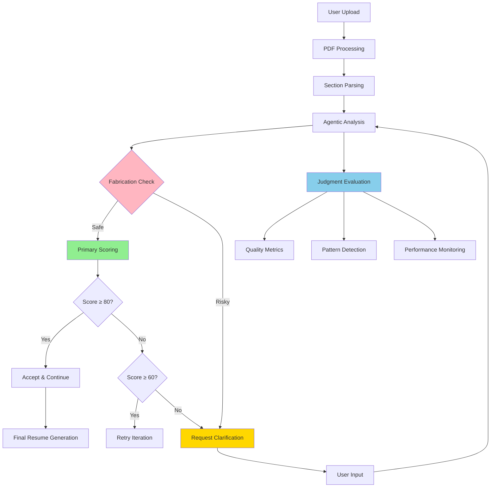

# ResumeWise - AI-Powered Agentic Resume Analyzer

> **Intelligent resume analysis with dual-system architecture: fast decision-making powered by comprehensive observability**

[](https://opensource.org/licenses/MIT)
[](https://www.python.org/downloads/)
[](https://fastapi.tiangolo.com)
[](https://nextjs.org/)
[](https://judgmentlabs.ai)

## What is ResumeWise?

ResumeWise is an **agentic AI system** that analyzes and improves resumes through iterative refinement with built-in **anti-fabrication protection**. Unlike simple AI tools, ResumeWise operates as an autonomous agent that:

- **Thinks iteratively** through multiple improvement cycles (up to 5 iterations per section)
- **Self-evaluates** each iteration for quality using dual-system architecture
- **Makes intelligent decisions** about when to accept, retry, or request clarification
- **Prevents fabrication** through rigorous content verification
- **Learns patterns** from verification failures
- **Maintains transparency** through comprehensive observability via Judgment SDK

### Key Features
- **Agentic Architecture**: Autonomous decision-making with human-in-the-loop clarification
- **Anti-Fabrication Protection**: Prevents addition of false achievements or experiences  
- **Dual-System Evaluation**: Fast primary scoring + comprehensive quality analysis
- **Multi-Perspective Analysis**: 6 different analytical viewpoints per section
- **Real-time Monitoring**: Complete observability via Judgment Labs integration
- **Human-in-the-Loop**: Interactive clarification when fabrication risks detected

## Dual-System Architecture

ResumeWise implements a sophisticated **dual-system approach** that combines speed with deep insights:

### Primary Scoring System
- **Purpose**: Real-time agent decision making
- **Speed**: < 1 second per decision
- **Model**: GPT-4o-mini for efficiency
- **Function**: Drives accept/retry/clarify logic
- **Scoring**: Simple 1-100 scale for immediate action

### Judgment Framework Integration
- **Purpose**: Comprehensive quality analysis and monitoring
- **Speed**: 2-5 seconds (runs in parallel)
- **Model**: GPT-4o for detailed evaluation
- **Function**: Deep quality insights and pattern detection
- **Metrics**: Multi-dimensional assessment across 6 core areas



## How the Agent Works

### 1. Iterative Improvement Process

Each resume section undergoes up to 5 improvement iterations:

```python
# Simplified agent workflow
for section in ['skills', 'education', 'experience', 'projects']:
    for iteration in range(1, 6):
        # Rotate perspectives for diverse analysis
        perspective = perspectives[iteration % len(perspectives)]
        
        # Generate improvement
        improved_content = await generate_improvement(
            content=section_content,
            perspective=perspective,
            job_requirements=job_analysis
        )
        
        # Dual-system evaluation
        primary_score = await primary_scoring(improved_content)  # Fast
        judgment_analysis = judgment.evaluate(improved_content)  # Deep
        
        # Agent decision logic
        if fabrication_detected(improved_content):
            request_clarification()
            break
        elif primary_score >= 80:
            accept_version()
            break
        elif primary_score >= 60:
            continue  # Try next iteration
        else:
            request_clarification()
            break
```

### 2. Multi-Perspective Analysis

The agent analyzes each section from different viewpoints:

| Perspective | Focus Area | Key Improvements |
|-------------|------------|------------------|
| **Hiring Manager** | Job relevance and impact | Aligns content with job requirements |
| **Technical Lead** | Technical skills and depth | Emphasizes technical competencies |
| **HR Recruiter** | ATS and initial screening | Optimizes keywords and formatting |
| **ATS Optimizer** | Keyword optimization | Ensures machine readability |
| **Industry Expert** | Domain-specific improvements | Adds industry-relevant enhancements |
| **Executive Coach** | Professional presentation | Refines language and structure |

### 3. Anti-Fabrication System

Every suggestion undergoes rigorous verification to prevent hallucinations:

- **Content Preservation**: Maintains factual accuracy of original content
- **Achievement Verification**: Prevents addition of non-existent accomplishments
- **Experience Validation**: Ensures no false work history additions
- **Skill Verification**: Avoids claiming non-mentioned technical skills
- **Metric Protection**: Blocks fabricated performance numbers/percentages

## Judgment SDK Integration

ResumeWise integrates deeply with the **Judgment Labs SDK** for comprehensive observability and quality assurance.

### SDK Architecture

```python
# Core Judgment integration in resume_agent.py
from judgeval.common.tracer import Tracer, wrap
from judgeval.scorers import (
    AnswerRelevancyScorer,
    FaithfulnessScorer,
    AnswerCorrectnessScorer,
    HallucinationScorer
)

# Initialize Judgment tracer
judgment = Tracer(
    api_key=os.getenv("JUDGMENT_API_KEY"),
    project_name="resume-critic-ai",
    enable_monitoring=True,
    deep_tracing=True
)

# Wrap OpenAI client for automatic tracing
self.client = wrap(AsyncOpenAI(api_key=api_key))
```

### Comprehensive Monitoring Features

#### Real-time Trace Visualization
```
resume_analysis_session (52.48s) [$0.002]
├── section_improvement (Skills) (12.3s)
│   ├── OPENAI_API_CALL (3.94s) - Content Generation
│   ├── OPENAI_API_CALL (3.84s) - Quality Evaluation  
│   ├── OPENAI_API_CALL (2.1s) - Fabrication Check
│   └── ✅ Iteration Accepted (Score: 85)
├── section_improvement (Education) (15.2s)
├── section_improvement (Experience) (18.7s)
└── section_improvement (Projects) (22.1s)
```

#### Quality Metrics Dashboard

| Metric | Threshold | Purpose |
|--------|-----------|---------|
| **Structure Accuracy** | 0.8 | Professional formatting and organization |
| **Job Relevance** | 0.6 | Alignment with job requirements |
| **Formatting Quality** | 0.7 | ATS compatibility and readability |
| **Content Faithfulness** | 0.9 | No hallucinations or fabrications |
| **Clarity & Conciseness** | 0.7 | Clear, impactful communication |
| **Improvement Quality** | 0.1 | Overall enhancement effectiveness |

#### Automated Pattern Detection

The Judgment SDK automatically detects and alerts on:

- **Fabrication Patterns**: "5+ failed experience suggestions in a row"
- **Quality Degradation**: Dropping scores across iterations
- **Performance Issues**: Unusually long processing times
- **Cost Anomalies**: Unexpected API usage spikes
- **Error Clusters**: Repeated failures in specific sections

#### Advanced Analytics

Access comprehensive insights at [platform.judgmentlabs.ai](https://platform.judgmentlabs.ai):

1. **Traces Tab**: Complete agent execution flows with cost tracking
2. **Evaluations Tab**: Quality scores, pass/fail rates, and trends
3. **Monitoring Tab**: Agent actions, error patterns, and alerts
4. **Analytics Tab**: Performance trends, cost analysis, and usage patterns

### Judgment SDK Configuration

```python
# Environment variables for Judgment integration
JUDGMENT_API_KEY=your_judgment_api_key        # Required for tracing
JUDGMENT_ORG_ID=your_organization_id          # Required for team access
JUDGMENT_MONITORING=true                      # Enable real-time monitoring
JUDGMENT_EVALUATIONS=true                     # Enable quality evaluations

# Optional: Advanced configuration
JUDGMENT_PROJECT_NAME="resume-critic-ai"     # Custom project name
JUDGMENT_DEEP_TRACING=true                   # Detailed trace capture
JUDGMENT_ASYNC_EVALUATION=true               # Non-blocking evaluations
```

## Technical Stack

### Backend (Python 3.11+)
- **Framework**: FastAPI 0.109.2 for high-performance API
- **AI Models**: OpenAI GPT-4o and GPT-4o-mini
- **Agent Framework**: Custom iterative agentic system
- **Monitoring**: Judgment Labs SDK integration
- **Processing**: pdfplumber for PDF parsing and text analysis
- **Validation**: Pydantic for request/response validation

### Frontend (React/Next.js)
- **Framework**: Next.js 15.2.4 with App Router
- **Styling**: Tailwind CSS with shadcn/ui components
- **State Management**: React hooks and context
- **File Upload**: Drag-and-drop PDF processing
- **UI Components**: Modern, accessible design system

### Observability & Monitoring
- **Tracing**: Automatic LLM call tracing via Judgment SDK
- **Evaluation**: Real-time quality assessment with custom scorers
- **Monitoring**: Agent action logging and pattern detection
- **Analytics**: Performance metrics, cost tracking, and trend analysis

## Quick Start

### Prerequisites
- Python 3.11 or higher
- Node.js 18 or higher
- OpenAI API key
- Judgment Labs API key (optional but recommended)

### One-Command Setup

```bash
# Clone and start everything
git clone <your-repo-url>
cd resume-critic-ai
chmod +x start.sh
./start.sh
```

The `start.sh` script will:
1. ✅ Check prerequisites (Python, Node.js, npm)
2. ✅ Setup Python virtual environment
3. ✅ Install all dependencies
4. ✅ Create environment configuration
5. ✅ Start both backend (port 8000) and frontend (port 3000)
6. ✅ Verify services are running

### Manual Setup

#### 1. Backend Setup

```bash
cd backend

# Create and activate virtual environment
python -m venv .venv
source .venv/bin/activate  # Windows: .venv\Scripts\activate

# Install dependencies
pip install --upgrade pip
pip install -r requirements.txt

# Configure environment variables
cp .env.example .env
```

Edit `.env` with your API keys:
```bash
# Required: OpenAI Configuration
OPENAI_API_KEY=sk-your_openai_api_key_here

# Recommended: Judgment Labs Configuration  
JUDGMENT_API_KEY=your_judgment_api_key_here
JUDGMENT_ORG_ID=your_judgment_org_id_here

# Optional: Monitoring Configuration
JUDGMENT_MONITORING=true
JUDGMENT_EVALUATIONS=true
```

Start the backend:
```bash
uvicorn app.main:app --reload --port 8000
```

#### 2. Frontend Setup

```bash
cd frontend

# Install dependencies
npm install

# Start development server
npm run dev
```

### 3. Access Application

- **Frontend Application**: http://localhost:3000
- **Backend API**: http://localhost:8000
- **API Documentation**: http://localhost:8000/docs
- **Judgment Dashboard**: https://platform.judgmentlabs.ai

## Usage Guide

### Basic Workflow

1. **Upload Resume**: Drag and drop a PDF file
2. **Add Job Description**: Paste the target job description
3. **Start Analysis**: Click "Begin Analysis"
4. **Provide Clarifications**: Answer questions when prompted
5. **Review Changes**: Accept or reject suggested improvements
6. **Download Result**: Get your improved resume

### Human-in-the-Loop Clarification

When the agent detects potential fabrication risks, it will ask for clarification:

```
❓ Clarification Needed: Skills Section

The job requires "Docker containerization experience" but this isn't 
mentioned in your current skills. Do you have Docker experience?

Options:
- "Yes, I have 2 years of Docker experience with Kubernetes"
- "No, I don't have Docker experience"
- "I have basic exposure through coursework"
```

### API Endpoints

| Endpoint | Method | Purpose |
|----------|---------|---------|
| `/health` | GET | Service health check |
| `/api/start-analysis` | POST | Begin resume analysis |
| `/api/analyze-section` | POST | Get section analysis results |
| `/api/provide-clarification` | POST | Submit user clarification |
| `/api/accept-changes` | POST | Accept/reject section changes |
| `/api/generate-final-resume` | POST | Generate final improved resume |
| `/api/session-status/{id}` | GET | Check session status |

## Configuration & Tuning

### Agent Parameters

Key settings in `backend/app/core/resume_agent.py`:

```python
# Iteration Settings
max_iterations = 5              # Maximum improvement cycles per section
quality_threshold = 90          # Target quality score

# Decision Thresholds
accept_threshold = 80           # Auto-accept above this score
retry_threshold = 60            # Retry between 60-79
clarify_threshold = 60          # Request clarification below 60

# Evaluation Thresholds (Judgment SDK)
structure_accuracy = 0.8        # Professional formatting
job_relevance = 0.6            # Job description alignment
formatting_quality = 0.7       # ATS compatibility  
content_faithfulness = 0.9     # Anti-fabrication
clarity_conciseness = 0.7      # Communication quality
```

### Performance Tuning

```python
# OpenAI API Configuration
OPENAI_TIMEOUT = 60.0          # Request timeout
OPENAI_MAX_RETRIES = 3         # Retry failed requests

# Judgment Configuration
JUDGMENT_BATCH_SIZE = 10       # Evaluation batch size
JUDGMENT_ASYNC_TIMEOUT = 30    # Async evaluation timeout
```

## Performance & Monitoring

### Expected Performance
- **Analysis Time**: 45-60 seconds per resume
- **Cost per Analysis**: ~$0.002 (OpenAI API)
- **Success Rate**: 85-95% (sections improved without clarification)
- **Accuracy**: 95%+ (no fabricated content)
- **Iteration Average**: 2.3 iterations per section

### Monitoring Dashboard

The Judgment Labs dashboard provides:

#### Real-time Metrics
- Active analysis sessions
- Average processing time
- Cost per analysis
- Success/failure rates

#### Quality Trends
- Section improvement scores over time
- Fabrication detection rates
- User clarification frequency
- Agent decision accuracy

#### Performance Analytics
- API response times
- Token usage patterns
- Error rate analysis
- Cost optimization insights

### Key Metrics to Track
- Section improvement success rates
- Average iterations per section  
- Primary scoring accuracy
- Pattern detection alerts
- Cost per successful analysis
- Human-in-the-loop engagement rate

## Security & Privacy

### Data Protection
- **No Data Storage**: Resume content processed in memory only
- **HTTPS Only**: All API communications encrypted
- **Environment Isolation**: Separate dev/prod configurations
- **Content Verification**: Prevents fabricated information injection
- **Audit Trails**: Complete trace of all agent decisions

### API Security
- **API Key Authentication**: Required for OpenAI and Judgment access
- **CORS Protection**: Configured for development/production
- **Rate Limiting**: Built into OpenAI client
- **Request Validation**: Pydantic schema validation

### Privacy Considerations
- Resume content never logged or stored permanently
- Session data cleared after completion
- API keys secured via environment variables
- Judgment traces can be configured for data retention policies

## Troubleshooting

### Common Issues

#### "OPENAI_API_KEY not set" Error
```bash
# Solution: Set your OpenAI API key
export OPENAI_API_KEY=sk-your_key_here
# Or add to backend/.env file
```

#### Judgment Integration Issues
```bash
# Check Judgment configuration
curl -s https://api.judgmentlabs.ai/health

# Verify environment variables
echo $JUDGMENT_API_KEY
echo $JUDGMENT_ORG_ID
```

#### Port Already in Use
```bash
# Kill existing processes
lsof -ti:8000 | xargs kill  # Backend
lsof -ti:3000 | xargs kill  # Frontend

# Or use different ports
uvicorn app.main:app --port 8001
npm run dev -- --port 3001
```

#### Package Installation Issues
```bash
# Backend dependencies
pip install --upgrade pip setuptools wheel
pip install -r requirements.txt --no-cache-dir

# Frontend dependencies  
rm -rf node_modules package-lock.json
npm install
```

#### Agent Performance Issues
- Check OpenAI API status: https://status.openai.com
- Monitor Judgment dashboard for errors
- Verify model availability (GPT-4o, GPT-4o-mini)
- Check rate limits and quotas

### Debug Mode

Enable verbose logging:
```bash
# Backend debug mode
export LOG_LEVEL=DEBUG
uvicorn app.main:app --reload --log-level debug

# View Judgment traces
# Visit: https://platform.judgmentlabs.ai/traces
```

### Getting Help

- **Documentation**: Check this README and inline code comments
- **Issues**: [GitHub Issues](https://github.com/your-repo/issues)
- **Monitoring**: [Judgment Platform](https://platform.judgmentlabs.ai)
- **Support**: Contact via your preferred support channel

## Development

### Project Structure
```
resume-critic-ai/
├── backend/                 # FastAPI backend
│   ├── app/
│   │   ├── core/           # Agent logic & configuration
│   │   ├── utils/          # PDF parsing utilities
│   │   └── main.py         # FastAPI application
│   ├── tests/              # Comprehensive test suite
│   └── requirements.txt    # Python dependencies
├── frontend/               # Next.js frontend
│   ├── app/               # Next.js app router
│   ├── components/        # React components
│   └── lib/               # Utility functions
├── start.sh               # One-command setup script
└── README.md              # This file
```

### Contributing

We welcome contributions! Development workflow:

1. **Fork** the repository
2. **Create** a feature branch (`git checkout -b feature/amazing-feature`)
3. **Commit** your changes (`git commit -m 'Add amazing feature'`)
4. **Push** to the branch (`git push origin feature/amazing-feature`)
5. **Open** a Pull Request

### Testing

```bash
# Backend tests
cd backend
pytest tests/ -v --cov=app

# Frontend tests (if configured)
cd frontend  
npm test
```

## Deployment

### Environment Preparation

Production deployment requires:
- Secure API key management
- HTTPS configuration  
- Environment-specific CORS settings
- Judgment production project setup

### Docker Deployment (Optional)

```dockerfile
# Example Dockerfile for backend
FROM python:3.11-slim
WORKDIR /app
COPY requirements.txt .
RUN pip install -r requirements.txt
COPY . .
EXPOSE 8000
CMD ["uvicorn", "app.main:app", "--host", "0.0.0.0", "--port", "8000"]
```


## Acknowledgments

- **[Judgment Labs](https://judgmentlabs.ai)** for the comprehensive observability platform and SDK
- **[OpenAI](https://openai.com)** for the powerful GPT-4o and GPT-4o-mini models
- **[FastAPI](https://fastapi.tiangolo.com)** for the high-performance Python web framework
- **[Next.js](https://nextjs.org)** for the excellent React framework
- **[shadcn/ui](https://ui.shadcn.com)** for the beautiful component library

## Support & Community

- **Bug Reports**: [GitHub Issues](https://github.com/your-repo/issues)
- **Feature Requests**: [GitHub Discussions](https://github.com/your-repo/discussions)
- **Monitoring**: [Judgment Platform](https://platform.judgmentlabs.ai)
- **Documentation**: [API Docs](http://localhost:8000/docs) when running locally

---

**Built with care for better resumes and careers** 