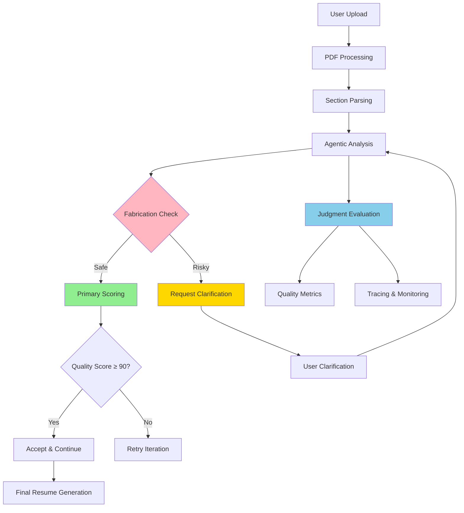

# ResumeWise - AI-Powered Agentic Resume Analyzer

> **Intelligent resume analysis with iterative improvement and anti-fabrication protection**

[](https://www.python.org/downloads/)
[](https://fastapi.tiangolo.com)
[](https://nextjs.org/)
[](https://judgmentlabs.ai)

## What is ResumeWise?

ResumeWise is an **agentic AI system** that analyzes and improves resumes through iterative refinement with built-in **anti-fabrication protection**. The system operates as an autonomous agent that:

- **Iterates intelligently** through multiple improvement cycles (up to 5 iterations per section)
- **Self-evaluates** each iteration using a dual-system architecture
- **Makes decisions** about when to accept, retry, or request human clarification
- **Prevents fabrication** through rigorous content verification before any improvements
- **Maintains transparency** through comprehensive observability via Judgment SDK integration

### Key Features
- **Agentic Architecture**: Autonomous decision-making with human-in-the-loop workflow
- **Anti-Fabrication Protection**: Prevents addition of false achievements, skills, or experiences
- **Dual-System Evaluation**: Fast primary scoring for agent decisions + comprehensive quality analysis
- **Multi-Perspective Analysis**: Different analytical viewpoints for each section
- **Observability**: Complete tracing and monitoring via Judgment Labs SDK
- **Human-in-the-Loop**: Interactive clarification when fabrication risks are detected

## System Architecture

ResumeWise implements a **dual-system approach** combining fast decision-making with comprehensive analysis:

### Primary Scoring System
- **Purpose**: Real-time agent decision making
- **Model**: GPT-4o-mini for efficiency
- **Function**: Drives accept/retry/clarify logic
- **Threshold**: Targets quality score of 90+ for acceptance

### Judgment Framework Integration
- **Purpose**: Comprehensive quality analysis and monitoring
- **Function**: Deep quality insights, tracing, and pattern detection
- **Fallback**: System continues functioning when Judgment SDK is unavailable



## How the Agent Works

### 1. Iterative Improvement Process

Each resume section undergoes systematic improvement:

```python
# Actual agent workflow from resume_agent.py
for section_type in ['skills', 'education', 'experience', 'projects']:
    # Run fabrication detection FIRST
    fabrication_risk = await self._detect_fabrication_risk(content, job_analysis)
    
    if fabrication_risk['needs_clarification']:
        request_clarification()
        continue
    
    # Iterative improvement loop
    for iteration in range(self.max_iterations):  # max_iterations = 5
        perspective = self.perspective_rotation[iteration % len(perspectives)]
        
        # Generate improvement with current perspective
        improved_content = await self._generate_content_with_perspective(
            content, section_type, job_analysis, perspective, iteration + 1
        )
        
        # Dual-system evaluation
        primary_score = await self._score_content_quality(improved_content)
        judgment_analysis = judgment.evaluate(improved_content)  # Async
        
        # Agent decision logic
        if primary_score >= self.quality_threshold:  # quality_threshold = 90
            accept_content()
            break
        elif iteration < self.max_iterations - 1:
            continue  # Try next iteration
        else:
            # Use best available version
            use_best_version()
```

### 2. Multi-Perspective Analysis

The agent analyzes each section from different analytical viewpoints:

| Perspective | Implementation | Focus Area |
|-------------|---------------|------------|
| **Hiring Manager** | `AnalysisPerspective.HIRING_MANAGER` | Job relevance and impact |
| **Technical Lead** | `AnalysisPerspective.TECHNICAL_LEAD` | Technical skills and depth |
| **HR Recruiter** | `AnalysisPerspective.HR_RECRUITER` | ATS and initial screening |
| **ATS Optimizer** | `AnalysisPerspective.ATS_OPTIMIZER` | Keyword optimization |
| **Industry Expert** | `AnalysisPerspective.INDUSTRY_EXPERT` | Domain-specific improvements |
| **Executive Coach** | `AnalysisPerspective.EXECUTIVE_COACH` | Professional presentation |

### 3. Anti-Fabrication System

Every improvement undergoes rigorous verification in `_detect_fabrication_risk()`:

**Critical Fabrication Detection:**
- Specific percentage claims not in original content
- Quantified metrics or achievements not provided by user
- New technologies/skills absent from original content  
- Entirely new projects, roles, or experiences
- Specific company achievements or business metrics

**Safe Improvements (Always Allowed):**
- Professional rephrasing of existing content
- Formatting and organization improvements
- Better wording without adding claims
- Industry-standard terminology for existing concepts
- Grammar and clarity improvements

## Judgment SDK Integration

ResumeWise integrates with the **Judgment Labs SDK** for comprehensive observability:

### Core Integration

```python
# From resume_agent.py
from judgeval.common.tracer import wrap
from .judgment_config import get_judgment_tracer, get_judgment_evaluator

# Initialize with fallback support
try:
    self.client = wrap(AsyncOpenAI(api_key=api_key))
    judgment = get_judgment_tracer()
    evaluator = get_judgment_evaluator()
except ImportError:
    # Graceful fallback when SDK not available
    self.client = AsyncOpenAI(api_key=api_key)
```

### Monitoring Capabilities

When enabled, the system provides:

#### Real-time Tracing
- Complete trace of all LLM calls and agent decisions
- Section-by-section analysis visualization
- Performance metrics and cost tracking

#### Quality Evaluation
- **Structure Accuracy**: Professional formatting assessment
- **Job Relevance**: Alignment with job requirements
- **Content Faithfulness**: Verification of no fabrications
- **Formatting Quality**: ATS compatibility
- **Clarity & Conciseness**: Communication effectiveness

#### Pattern Detection
- Fabrication attempt detection
- Quality improvement patterns
- User interaction analytics

### Environment Configuration

```bash
# Required for core functionality
OPENAI_API_KEY=your_openai_api_key

# Optional for enhanced observability
JUDGMENT_API_KEY=your_judgment_api_key
JUDGMENT_ORG_ID=your_organization_id
```

## Technical Implementation

### Backend (Python 3.11+)
- **Framework**: FastAPI 0.109.2 for high-performance API
- **AI Models**: OpenAI GPT-4o-mini for all LLM operations
- **Agent Logic**: Custom iterative improvement system in `resume_agent.py`
- **Processing**: pdfplumber for PDF parsing and text extraction
- **Validation**: Pydantic for request/response validation
- **Observability**: Judgment Labs SDK integration with fallback support

### Frontend (React/Next.js)
- **Framework**: Next.js 15.2.4 with App Router
- **Language**: TypeScript for type safety
- **Styling**: Tailwind CSS with shadcn/ui components
- **State Management**: React hooks for session management
- **File Upload**: Supports PDF, DOC, DOCX, TXT with validation
- **Real-time UI**: Progress tracking and clarification modals

## Quick Start

### Prerequisites
- Python 3.11 or higher
- Node.js 18 or higher
- OpenAI API key
- Judgment Labs API key (optional for enhanced observability)

### One-Command Setup

```bash
# Clone and start everything
git clone <your-repo-url>
cd resume-critic-ai
chmod +x start.sh
./start.sh
```

The `start.sh` script will:
1. Check prerequisites (Python, Node.js, npm)
2. Setup Python virtual environment
3. Install all dependencies
4. Create environment configuration
5. Start backend (port 8000) and frontend (port 3000)
6. Verify services are running

### Manual Setup

#### 1. Backend Setup

```bash
cd backend

# Create and activate virtual environment
python -m venv .venv
source .venv/bin/activate  # Windows: .venv\Scripts\activate

# Install dependencies
pip install -r requirements.txt

# Configure environment
cp .env.example .env
# Edit .env with your OPENAI_API_KEY
```

Start the backend:
```bash
uvicorn app.main:app --reload --port 8000
```

#### 2. Frontend Setup

```bash
cd frontend

# Install dependencies
npm install

# Start development server
npm run dev
```

### 3. Access Application

- **Frontend**: http://localhost:3000
- **Backend API**: http://localhost:8000
- **API Documentation**: http://localhost:8000/docs
- **Health Check**: http://localhost:8000/health

## Usage Guide

### Basic Workflow

1. **Upload Resume**: Drag and drop PDF/DOC/DOCX/TXT file
2. **Add Job Description**: Paste the target job posting
3. **Start Analysis**: Click "Begin Analysis"
4. **Provide Clarifications**: Answer questions when fabrication risks are detected
5. **Review Changes**: Accept or reject improvements for each section
6. **Download Result**: Get your improved resume

### Human-in-the-Loop Clarification

When fabrication risks are detected, you'll see:

```
❓ Clarification Needed: Skills Section

The job requires "Docker containerization" but this technology isn't 
mentioned in your current skills. Do you have Docker experience?

Please provide details or confirm you don't have this experience.
```

### API Endpoints

| Endpoint | Method | Purpose |
|----------|---------|---------|
| `/health` | GET | Service health check |
| `/api/start-analysis` | POST | Begin resume analysis session |
| `/api/analyze-section` | POST | Get specific section analysis |
| `/api/provide-clarification` | POST | Submit user clarification |
| `/api/accept-changes` | POST | Accept/reject section changes |
| `/api/generate-final-resume` | POST | Generate final improved resume |
| `/api/session-status/{id}` | GET | Check session status |

## Configuration

### Agent Parameters

Key settings in `backend/app/core/resume_agent.py`:

```python
# Iteration configuration
self.max_iterations = 5          # Maximum improvement cycles per section
self.quality_threshold = 90      # Target quality score for acceptance

# Analysis configuration
self.analysis_order = [          # Section processing order
    SectionType.SKILLS,
    SectionType.EDUCATION,
    SectionType.EXPERIENCE,
    SectionType.PROJECTS
]
```

### Model Configuration

```python
# OpenAI configuration
model="gpt-4o-mini"             # Used for all LLM operations
temperature=0.1                 # Low temperature for consistent results
timeout=60.0                    # Request timeout in seconds
max_retries=3                   # Retry configuration
```

## Security & Privacy

### Data Protection
- **No Data Storage**: Resume content processed in memory only
- **Session Management**: Temporary session data cleared after completion
- **Environment Variables**: Secure API key management
- **Content Verification**: Prevents injection of fabricated information

### API Security
- **Authentication**: OpenAI and Judgment API key authentication
- **CORS Configuration**: Properly configured for development/production
- **Request Validation**: Comprehensive Pydantic schema validation
- **Error Handling**: Secure error responses without data leakage

## Troubleshooting

### Common Issues

#### OpenAI API Key Error
```bash
# Set your OpenAI API key
export OPENAI_API_KEY=sk-your_key_here
# Or add to backend/.env file
```

#### Port Already in Use
```bash
# Kill existing processes
lsof -ti:8000 | xargs kill  # Backend
lsof -ti:3000 | xargs kill  # Frontend
```

#### Dependencies Issues
```bash
# Backend
pip install --upgrade pip
pip install -r requirements.txt

# Frontend
rm -rf node_modules package-lock.json
npm install
```

### Debug Mode

Enable verbose logging:
```bash
export LOG_LEVEL=DEBUG
uvicorn app.main:app --reload --log-level debug
```

## Development

### Project Structure
```
resume-critic-ai/
├── backend/                    # FastAPI backend
│   ├── app/
│   │   ├── core/              # Agent logic & configuration
│   │   │   ├── resume_agent.py        # Main agent implementation
│   │   │   ├── judgment_config.py     # Judgment SDK integration
│   │   │   └── logging_config.py      # Logging configuration
│   │   ├── utils/             # Utilities
│   │   │   └── pdf_parser.py          # PDF text extraction
│   │   └── main.py            # FastAPI application
│   ├── tests/                 # Test suite
│   └── requirements.txt       # Python dependencies
├── frontend/                  # Next.js frontend
│   ├── app/                   # Next.js app router
│   │   ├── page.tsx           # Main application
│   │   └── layout.tsx         # App layout
│   ├── components/            # React components
│   │   └── ui/                # UI component library
│   └── lib/                   # Utility functions
├── start.sh                   # One-command setup script
└── README.md                  # This documentation
```

### Testing

```bash
# Backend tests
cd backend
pytest tests/ -v

# Frontend tests (if configured)
cd frontend
npm test
```

## Deployment Considerations

### Production Requirements
- Secure API key management
- HTTPS configuration
- Environment-specific CORS settings
- Monitoring and logging infrastructure

### Docker Support
The codebase can be containerized using standard Docker practices for FastAPI and Next.js applications.

## Acknowledgments

- **[Judgment Labs](https://judgmentlabs.ai)** for the observability platform and SDK
- **[OpenAI](https://openai.com)** for the GPT-4o-mini model
- **[FastAPI](https://fastapi.tiangolo.com)** for the Python web framework
- **[Next.js](https://nextjs.org)** for the React framework
- **[shadcn/ui](https://ui.shadcn.com)** for the component library

---

**Professional resume analysis with integrity and transparency** 