# ResumeWise - AI-Powered Agentic Resume Analyzer

> **Intelligent resume analysis with dual-system architecture: fast decision-making powered by comprehensive observability**

[](https://opensource.org/licenses/MIT)
[](https://www.python.org/downloads/)
[](https://fastapi.tiangolo.com)
[](https://nextjs.org/)

## 🚀 **What is ResumeWise?**

ResumeWise is an **agentic AI system** that analyzes and improves resumes through iterative refinement. Unlike simple AI tools, ResumeWise operates as an autonomous agent that:

- **Thinks iteratively** through multiple improvement cycles
- **Self-evaluates** each iteration for quality
- **Makes intelligent decisions** about when to accept, retry, or request clarification
- **Learns patterns** from verification failures
- **Maintains transparency** through comprehensive observability

## 🏗️ **Dual-System Architecture**

ResumeWise implements a sophisticated **dual-system approach** that combines speed with insights:

### ⚡ **Primary Scoring System**
- **Purpose**: Real-time agent decision making
- **Speed**: < 1 second per decision
- **Model**: GPT-4o-mini for efficiency
- **Function**: Drives accept/retry/clarify logic
- **Scoring**: Simple 1-100 scale for immediate action

### 🔬 **Judgment Framework Integration**
- **Purpose**: Comprehensive quality analysis and monitoring
- **Speed**: 2-5 seconds (runs in parallel)
- **Model**: GPT-4o for detailed evaluation
- **Function**: Deep quality insights and pattern detection
- **Metrics**: Multi-dimensional assessment across 6 core areas

```mermaid
graph TD
    A[User Upload] --> B[Agentic Analysis]
    B --> C{Primary Scoring}
    B --> D[Judgment Evaluation]
    
    C --> E[Fast Decision<br/>< 1 second]
    E --> F{Score ≥ 80?}
    F -->|Yes| G[✅ Accept]
    F -->|No| H{Score ≥ 60?}
    H -->|Yes| I[🔄 Retry]
    H -->|No| J[❓ Clarify]
    
    D --> K[Quality Insights<br/>2-5 seconds]
    K --> L[Pattern Detection]
    K --> M[Performance Monitoring]
    K --> N[Audit Trails]
    
    style C fill:#90EE90
    style D fill:#87CEEB
    style E fill:#FFD700
    style K fill:#DDA0DD
```



## 🧠 **How the Agent Works**

### **1. Iterative Improvement Process**

```python
# Each section goes through 5 improvement iterations
for iteration in range(1, 6):
    perspective = get_perspective(iteration)  # hiring_manager, technical_lead, etc.
    improved_content = generate_improvement(content, perspective)
    
    # Dual-system evaluation
    primary_score = await primary_scoring_system(improved_content)  # Fast decision
    judgment_evaluation = judgment_framework.evaluate(improved_content)  # Deep analysis
    
    if primary_score >= 80:
        break  # Accept this version
    elif primary_score >= 60:
        continue  # Try another iteration
    else:
        request_clarification()  # Need user input
```

### **2. Multi-Perspective Analysis**

The agent analyzes each section from different viewpoints:
- 👔 **Hiring Manager**: Focus on job relevance and impact
- 🔧 **Technical Lead**: Emphasize technical skills and depth
- 👥 **HR Recruiter**: Optimize for ATS and initial screening
- 🤖 **ATS Optimizer**: Ensure keyword optimization
- 🏆 **Industry Expert**: Add domain-specific improvements

### **3. Quality Verification System**

Every suggestion undergoes rigorous verification:
- **Fabrication Detection**: Prevents adding non-existent skills/experience
- **Content Preservation**: Maintains factual accuracy
- **Format Consistency**: Ensures professional presentation
- **Length Optimization**: Balances detail with conciseness

## 📊 **Judgment Framework Integration**

### **Comprehensive Monitoring**

The system tracks everything through the [Judgment Platform](https://platform.judgment.ai):

#### **🔍 Trace Visualization**
```
📋 resume_analysis_session (52.48s) [$0.002]
├── 🔧 section_improvement (Skills)
│   ├── 🤖 OPENAI_API_CALL (3.94s)
│   ├── 🤖 OPENAI_API_CALL (3.84s) 
│   └── ... (5 iterations total)
├── 🔧 section_improvement (Education)  
├── 🔧 section_improvement (Experience)
└── 🔧 section_improvement (Projects)
```

#### **📈 Quality Metrics**
- **Structure Accuracy** (threshold: 0.8): Professional formatting and organization
- **Job Relevance** (threshold: 0.6): Alignment with job requirements
- **Formatting Quality** (threshold: 0.7): ATS compatibility and readability
- **Content Faithfulness** (threshold: 0.9): No hallucinations or fabrications
- **Clarity & Conciseness** (threshold: 0.7): Clear, impactful communication
- **Improvement Quality** (threshold: 0.1): Overall enhancement effectiveness

#### **🚨 Pattern Detection**
- Automated alerts for unusual behavior (e.g., "5+ failed education suggestions in a row")
- Error trend analysis and root cause identification
- Performance degradation monitoring
- Quality improvement tracking over time

## 🛠️ **Technical Stack**

### **Backend (Python)**
- **Framework**: FastAPI for high-performance API
- **AI Models**: OpenAI GPT-4o and GPT-4o-mini
- **Agent Framework**: Custom iterative agentic system
- **Monitoring**: Judgment Labs integration
- **Processing**: Advanced PDF parsing and text analysis

### **Frontend (Next.js)**
- **Framework**: Next.js 14 with React
- **Styling**: Tailwind CSS with shadcn/ui components
- **State Management**: React hooks and context
- **File Upload**: Drag-and-drop PDF processing
- **UI**: Modern, responsive design

### **Observability**
- **Tracing**: Automatic LLM call tracing
- **Evaluation**: Real-time quality assessment
- **Monitoring**: Agent action logging and pattern detection
- **Analytics**: Performance metrics and cost tracking

## 🚀 **Quick Start**

### **1. Setup Backend**

```bash
cd backend

# Create virtual environment
python -m venv .venv
source .venv/bin/activate  # On Windows: .venv\Scripts\activate

# Install dependencies
pip install -r requirements.txt

# Set environment variables
cp .env.example .env
# Edit .env with your API keys:
# OPENAI_API_KEY=your_openai_key
# JUDGMENT_API_KEY=your_judgment_key
# JUDGMENT_ORG_ID=your_org_id

# Start server
python -m uvicorn app.main:app --reload --port 8000
```

### **2. Setup Frontend**

```bash
cd frontend

# Install dependencies
npm install

# Start development server
npm run dev
```

### **3. Access Application**

- **Frontend**: http://localhost:3000
- **Backend API**: http://localhost:8000
- **API Docs**: http://localhost:8000/docs
- **Judgment Dashboard**: https://platform.judgment.ai

## 🔧 **Configuration**

### **Environment Variables**

```bash
# OpenAI Configuration
OPENAI_API_KEY=your_openai_api_key

# Judgment Labs Configuration
JUDGMENT_API_KEY=your_judgment_api_key
JUDGMENT_ORG_ID=your_organization_id

# Optional: Disable monitoring in production
JUDGMENT_MONITORING=true
JUDGMENT_EVALUATIONS=true
```

### **Agent Tuning**

Key parameters in `backend/app/core/resume_agent.py`:

```python
# Iteration settings
max_iterations = 5
quality_threshold = 90

# Scoring thresholds
accept_threshold = 80    # Auto-accept above this score
retry_threshold = 60     # Retry between 60-79
clarify_threshold = 60   # Request clarification below 60

# Evaluation thresholds
structure_accuracy = 0.8
job_relevance = 0.6
formatting_quality = 0.7
content_faithfulness = 0.9
```

## 📈 **Performance & Monitoring**

### **Expected Performance**
- **Analysis Time**: 45-60 seconds per resume
- **Cost per Analysis**: ~$0.002 (OpenAI API)
- **Success Rate**: 85-95% (sections improved without clarification)
- **Accuracy**: 95%+ (no fabricated content)

### **Monitoring Dashboard**

Access comprehensive insights at [platform.judgment.ai](https://platform.judgment.ai):

1. **Traces Tab**: View complete agent execution flows
2. **Evaluations Tab**: Quality scores and pass/fail rates
3. **Monitoring Tab**: Agent actions, errors, and patterns
4. **Analytics**: Performance trends and cost analysis

### **Key Metrics to Track**
- Section improvement success rates
- Average iterations per section
- Primary scoring accuracy
- Pattern detection alerts
- Cost per successful analysis

## 🔒 **Security & Privacy**

- **No Data Storage**: Resume content is processed in memory only
- **API Security**: All communications use HTTPS
- **Environment Isolation**: Separate development/production configs
- **Content Verification**: Prevents injection of fabricated information
- **Audit Trails**: Complete trace of all agent decisions

## 🤝 **Contributing**

We welcome contributions! Please see our [Contributing Guidelines](CONTRIBUTING.md) for details.

### **Development Workflow**
1. Fork the repository
2. Create a feature branch (`git checkout -b feature/amazing-feature`)
3. Commit your changes (`git commit -m 'Add amazing feature'`)
4. Push to the branch (`git push origin feature/amazing-feature`)
5. Open a Pull Request

## 📄 **License**

This project is licensed under the MIT License - see the [LICENSE](LICENSE) file for details.

## 🙏 **Acknowledgments**

- **[Judgment Labs](https://judgment.ai)** for the comprehensive observability platform
- **OpenAI** for the powerful language models
- **FastAPI** and **Next.js** communities for excellent frameworks

## 📞 **Support**

- **Issues**: [GitHub Issues](https://github.com/your-repo/issues)
- **Documentation**: Check the `/backend/OPTIMIZED_JUDGMENT_INTEGRATION.md` for detailed integration info
- **Judgment Platform**: [platform.judgment.ai](https://platform.judgment.ai)

---

**Built with ❤️ for better resumes and careers** 