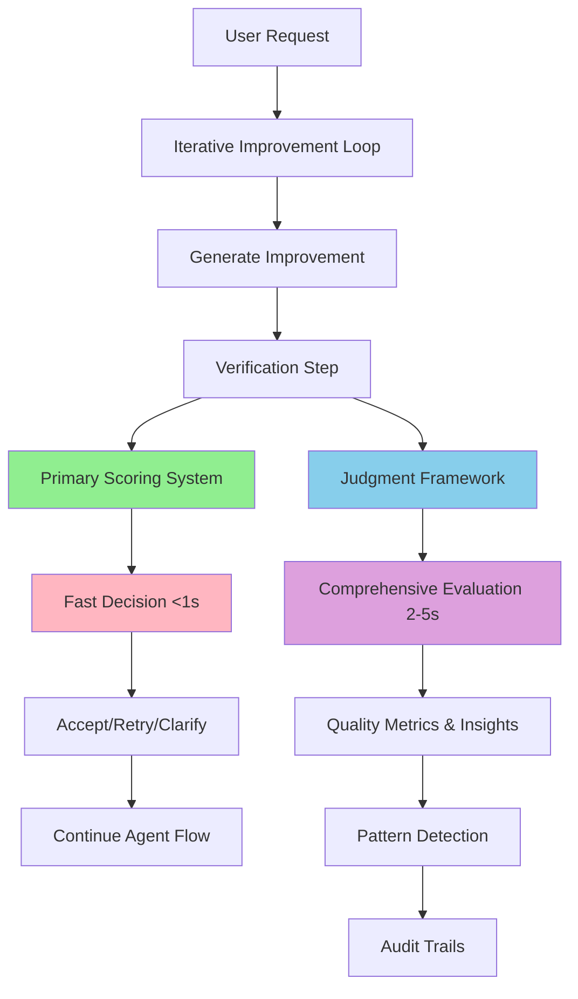

# Dual-System Integration: Primary Scoring + Judgment Framework

## Overview

We've successfully implemented a **dual-system architecture** that combines the best of both worlds:

1. **Primary Scoring System**: Fast, focused scoring for real-time agent decisions
2. **Judgment Framework**: Comprehensive evaluation for insights and monitoring

Both systems work **complementarily** without interfering with each other.

## Architecture



## Implementation Details

### 1. Primary Scoring System

**Purpose**: Drive real-time agent decisions (accept/reject/retry)

**Characteristics**:
- **Speed**: < 1 second execution
- **Model**: `gpt-4o-mini` (fast, cost-effective)
- **Output**: Simple integer score (1-100)
- **Focus**: Core decision criteria only

**Implementation**:
```python
async def _score_content_quality(self, content: str, section_type: SectionType, job_analysis: JobAnalysis) -> int:
    """
    PRIMARY SCORING SYSTEM: Fast, focused scoring for real-time agent decisions.
    This drives the accept/reject/retry logic and must be fast (< 1 second).
    """
    prompt = f"""
    Score this {section_type.value} section from 1-100 based on:
    - Professional formatting and structure (25%)
    - Relevance to job requirements (25%)
    - Clarity and conciseness (25%)
    - ATS compatibility (25%)
    
    Content: {content}
    Job Requirements: {job_analysis.key_requirements}
    
    Respond with ONLY a number from 1-100.
    """
    
    response = await self.client.chat.completions.create(
        model="gpt-4o-mini",  # Fast model for real-time decisions
        messages=[{"role": "user", "content": prompt}],
        temperature=0.1,
        max_tokens=10  # We only need a number
    )
    
    score_text = response.choices[0].message.content.strip()
    score = int(re.search(r'\d+', score_text).group())
    
    return max(1, min(100, score))
```

### 2. Judgment Framework

**Purpose**: Provide comprehensive insights and quality monitoring

**Characteristics**:
- **Speed**: 2-5 seconds (thorough analysis)
- **Model**: `gpt-4o` (high-quality evaluation)
- **Output**: Multi-dimensional metrics, patterns, insights
- **Execution**: Asynchronous (non-blocking)

**Implementation**:
```python
def _trigger_judgment_evaluation(self, 
                               original_content: str, 
                               improved_content: str, 
                               section_type: SectionType, 
                               job_analysis: JobAnalysis, 
                               primary_score: int,
                               iteration: int):
    """
    JUDGMENT FRAMEWORK: Comprehensive async evaluation that doesn't block agent flow.
    This provides rich insights, pattern detection, and audit trails.
    """
    # Run judgment evaluation asynchronously (non-blocking)
    asyncio.create_task(self._run_comprehensive_evaluation(
        original_content=original_content,
        improved_content=improved_content,
        section_type=section_type,
        job_analysis=job_analysis,
        primary_score=primary_score,
        iteration=iteration
    ))
```

### 3. Integration in Agent Loop

**Flow in Iterative Improvement**:

```python
# STEP 4: PRIMARY SCORING SYSTEM - Fast agent decision making
primary_score = await self._score_content_quality(
    content=improved_content,
    section_type=section_type,
    job_analysis=job_analysis
)

# Apply verification penalties to primary score
quality_score = primary_score
if verification_result["issues"]:
    penalty = sum(10 if issue["severity"] == "critical" else 
                 5 if issue["severity"] == "high" else 2 
                 for issue in verification_result["issues"])
    quality_score = max(1, primary_score - penalty)

# STEP 5: JUDGMENT FRAMEWORK - Comprehensive async evaluation (non-blocking)
self._trigger_judgment_evaluation(
    original_content=content,
    improved_content=improved_content,
    section_type=section_type,
    job_analysis=job_analysis,
    primary_score=quality_score,
    iteration=iteration + 1
)

# STEP 6: Agent continues with primary score for decisions
if quality_score >= 80:
    # Accept the improvement
elif quality_score >= 60:
    # Retry with refinements
else:
    # Request user clarification
```

## Benefits of Dual-System Approach

### ✅ Performance Benefits

1. **No Blocking**: Agent remains responsive
2. **Fast Decisions**: Primary scoring in < 1 second  
3. **Optimal Cost**: Uses appropriate models for each task
4. **Scalable**: Both systems scale independently

### ✅ Quality Benefits

1. **Comprehensive Insights**: Judgment provides rich metrics
2. **Pattern Detection**: Long-term trend analysis
3. **Audit Trails**: Complete decision history
4. **Multi-dimensional**: Beyond simple scores

### ✅ Reliability Benefits

1. **Fault Isolation**: Judgment failures don't break agent
2. **Graceful Degradation**: Agent works even without Judgment
3. **Independent Evolution**: Each system can be optimized separately
4. **Testing**: Can test each system independently

## Monitoring & Observability

### Primary System Metrics
- Response time (target: < 1s)
- Score distribution (1-100)
- Decision accuracy
- Error rates

### Judgment Framework Metrics  
- Evaluation completion rates
- Quality trend analysis
- Pattern detection insights
- Comprehensive audit logs

### Combined Analytics
- Correlation between primary scores and Judgment metrics
- Agent decision quality over time
- Performance optimization opportunities
- User satisfaction trends

## Configuration

### Environment Variables
```bash
# Primary scoring system
OPENAI_API_KEY=your_openai_key

# Judgment framework  
JUDGMENT_API_KEY=your_judgment_key
JUDGMENT_ORG_ID=your_judgment_org

# Optional: Toggle systems independently
ENABLE_PRIMARY_SCORING=true
ENABLE_JUDGMENT_EVALUATION=true
```

### System Toggles
```python
# Can disable Judgment without affecting primary system
if os.getenv("ENABLE_JUDGMENT_EVALUATION", "true").lower() == "true":
    self._trigger_judgment_evaluation(...)

# Can disable primary scoring for testing
if os.getenv("ENABLE_PRIMARY_SCORING", "true").lower() == "true":
    primary_score = await self._score_content_quality(...)
```

## Testing Strategy

### Unit Tests
- Test primary scoring system independently
- Test Judgment evaluation system independently  
- Test integration between both systems

### Performance Tests
- Primary scoring latency (< 1s requirement)
- Agent responsiveness with both systems
- Memory usage and resource consumption

### Quality Tests
- Compare primary scores vs Judgment metrics
- Validate agent decision quality
- Long-term trend analysis

## Future Enhancements

### Adaptive Scoring
- Use Judgment insights to improve primary scoring
- Adjust thresholds based on pattern detection
- Continuous learning from comprehensive evaluations

### Smart Routing
- Use primary score to determine when to trigger deep Judgment analysis
- Optimize resource usage based on content complexity
- Dynamic model selection

### Enhanced Integration
- Real-time alerts from pattern detection
- Automated quality improvement suggestions
- Cross-system metric correlation

## Summary

The dual-system integration provides:

🚀 **Fast Agent Performance**: Primary scoring keeps agent responsive
🔬 **Rich Insights**: Judgment framework provides comprehensive analysis  
🛡️ **High Reliability**: Systems work independently with graceful fallbacks
📈 **Continuous Improvement**: Both systems evolve and optimize separately

This architecture gives us **the best of both worlds**: real-time performance for user experience AND comprehensive insights for continuous improvement. 